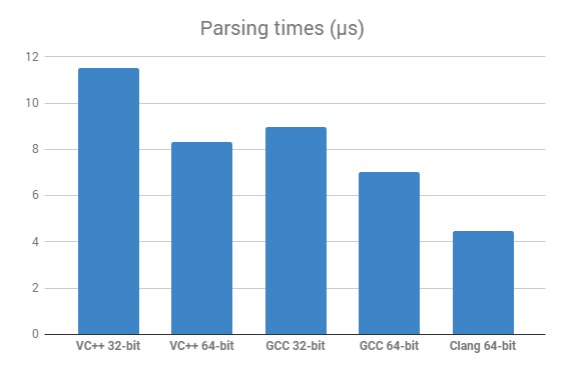

# croncpp

**croncpp** is a C++ header-only cross-platform library for handling CRON expressions. Works with any compiler that supports C++11 or anything newer. It implements two basic operations: parsing an expression and computing the next occurence of the scheduled time.

[](https://github.com/mariusbancila/croncpp/actions/workflows/ci.yml)

## CRON expressions
A CRON expression is a string composed of six or seven fields separated by a white space representing a time schedule. The general form is the following (with the `years` being optional):

```
<seconds> <minutes> <hours> <days of month> <months> <days of week> <years>
```

The following values are allowed for these fields:

| Field | Required | Allowed value * | Allowed value (alternative 1) ** | Allowed value (alternative 2) *** | Allowed special characters |
| --- | --- | --- | --- | --- | --- |
| seconds | yes | 0-59 | 0-59 | 0-59 | `*` `,` `-` |
| minutes | yes | 0-59 | 0-59 | 0-59 | `*` `,` `-` |
| hours | yes | 0-23 | 0-23 | 0-23 | `*` `,` `-` |
| days of month | 1-31 | 1-31 | 1-31 | 1-31 | `*` `,` `-` `?` `L` `W` |
| months | yes | 1-12 | 0-11 | 1-12 | `*` `,` `-` |
| days of week | yes | 0-6 | 1-7 | 1-7 | `*` `,` `-` `?` `L` `#` |
| years | no | 1970-2099 | 1970-2099 | 1970-2099 | `*` `,` `-` `/` |

\* - As described on Wikipedia [Cron](https://en.wikipedia.org/wiki/Cron)

** - As described on Oracle [Role Manager Integration Guide - A Cron Expressions](https://docs.oracle.com/cd/E12058_01/doc/doc.1014/e12030/cron_expressions.htm)

*** - As described for the Quartz scheduler [CronTrigger Tutorial](http://www.quartz-scheduler.org/documentation/quartz-1.x/tutorials/crontrigger)

The special characters have the following meaning:

| Special character | Meaning | Description |
| --- | --- | --- |
| `*` | all values | selects all values within a field |
| `?` | no specific value | specify one field and leave the other unspecified |
| `-` | range | specify ranges |
| `,` | comma | specify additional values |
| `/` | slash | speficy increments |
| `L` | last | last day of the month or last day of the week |
| `W` | weekday | the weekday nearest to the given day |
| `#` | nth |  specify the Nth day of the month |

`L`, `W` and `#` are only meaningful in the day fields, and each applies to a single value, so they cannot be combined with a list, a range or an increment. Used anywhere else, or combined, they are rejected by `make_cron()` with a `bad_cronexpr` exception.

| Expression | Field | Meaning |
| --- | --- | --- |
| `L` | days of month | the last day of the month |
| `LW` | days of month | the last weekday of the month |
| `15W` | days of month | the weekday nearest the 15th, without leaving the month |
| `L` | days of week | Saturday, as in Quartz |
| `5L` | days of week | the last Friday of the month |
| `5#2` | days of week | the second Friday of the month |

`W` moves to the nearest Monday to Friday: back one day from a Saturday, forward one day from a Sunday. It never crosses into another month, so `1W` on a Saturday is the Monday after, and `31W` on a Sunday is the Friday before. The weekday numbers in `5L` and `5#2` follow the traits in use, so the last Friday is `5L` with `cron_standard_traits` and `6L` with `cron_quartz_traits`.

### The two day fields

The days of month and days of week fields both select days, so an expression restricting both has to say what that means. The two dialects croncpp follows disagree, and each traits type states its own answer through `CRON_DAY_FIELD_RULE`:

| Traits | Rule | Meaning |
| --- | --- | --- |
| `cron_standard_traits` | `day_field_rule::either` | a date matching **either** field is a match, as in POSIX cron |
| `cron_quartz_traits`, `cron_oracle_traits` | `day_field_rule::reject` | the expression is an error; one of the two fields has to be `?` |

So `0 0 0 1 1 1` — midnight on the 1st of January, and on Mondays in January — resolves to the 1st of January 2021 under the standard traits, because that date matches the days of month half. Under the quartz and oracle traits the same expression is rejected, and `0 0 0 1 1 ?` or `0 0 0 ? 1 1` says which of the two was meant.

A field counts as restricted unless it is exactly `*` or `?`. `1-31` covers every day but is still a restriction, and POSIX treats it as one.

A traits type that does not declare `CRON_DAY_FIELD_RULE` gets `day_field_rule::intersect`, where a date has to match both fields. That was croncpp's behaviour before the rule existed, so custom traits written against an earlier version are unaffected.

The `years` field is optional, as in Quartz, and may be left out entirely. An expression whose years have all gone by has no next occurrence, so `cron_next()` reports failure for it: `INVALID_TIME` from the `std::time_t` overload, and a zeroed `std::tm` from the other.

A traits type opts into the year field by declaring `CRON_MIN_YEARS` and `CRON_MAX_YEARS`, as all three supplied ones do. A traits type written without them keeps accepting six fields and rejects a seventh, so custom traits written against an earlier version of croncpp continue to work unchanged. Note that the range croncpp can store is fixed at 1970-2099 whatever the traits say, so a traits type may narrow that range but not widen it.

**Note:** an expression describing a date that never occurs, such as `0 0 5 31 2 ?` for the 31st of February, is also rejected by `make_cron()` with a `bad_cronexpr` exception, because it has no next occurrence to compute. February is measured as a leap year, so the 29th is accepted and the 30th is not.

Examples: 

| CRON | Description |
| --- | --- |
| * * * * * * | Every second |
| */5 * * * * ? | Every 5 seconds |
| 0 */5 */2 * * ? | Every 5 minutes, every 2 hours |
| 0 */2 */2 ? */2 */2 | Every 2 minutes, every 2 hours, every 2 days of the week, every 2 months |
| 0 15 10 * * ? * | 10:15 AM every day |
| 0 0/5 14 * * ? | Every 5 minutes starting at 2 PM and ending at 2:55 PM, every day |
| 0 10,44 14 ? 3 WED | 2:10 PM and at 2:44 PM every Wednesday of March |
| 0 15 10 ? * MON-FRI | 10:15 AM every Monday, Tuesday, Wednesday, Thursday and Friday |
| 0 15 10 L * ? | 10:15 AM on the last day of every month |
| 0 15 10 LW * ? | 10:15 AM on the last weekday of every month |
| 0 15 10 15W * ? | 10:15 AM on the weekday nearest the 15th of every month |
| 0 15 10 ? * 5L | 10:15 AM on the last Friday of every month |
| 0 15 10 ? * 5#2 | 10:15 AM on the second Friday of every month |
| 0 15 10 * * ? 2005 | 10:15 AM every day during the year 2005 |
| 0 15 10 ? * 5L 2002-2006 | 10:15 AM on the last Friday of every month during 2002 to 2006 |
| 0 0 12 1/5 * ? | 12 PM every 5 days every month, starting on the first day of the month |
| 0 11 11 11 11 ? | Every November 11th at 11:11 AM |

## croncpp library

To parse a CRON expression use `make_cron()` as follows:

```
try
{
   auto cron = cron::make_cron("* 0/5 * * * ?");
}
catch (cron::bad_cronexpr const & ex)
{
   std::cerr << ex.what() << '\n';
}
```

`make_cron()` returns an object of the type `cronexpr`. The actual content of this object is not of real interest and, in fact, all its details are private. You can consider this as an implementation detail object that contains the necessary information for a CRON expression, in order to compute the next occurence of the time schedule, which is the actual important operation we are interested in.

To get the next occurence of the time schedule use the `cron_next()` function as follows:

```
try
{
   auto cron = cron::make_cron("* 0/5 * * * ?");
   
   std::time_t now = std::time(0);
   std::time_t next = cron::cron_next(cron, now);   
}
catch (cron::bad_cronexpr const & ex)
{
   std::cerr << ex.what() << '\n';
}
```

Alternatively, you can use `std::tm` instead of `std::time_t`:

```
try
{
   auto cron = cron::make_cron("* 0/5 * * * ?");
   
   std::tm time = cron::utils::to_tm("2018-08-08 20:30:45");
   std::tm next = cron::cron_next(cron, time);
}
catch (cron::bad_cronexpr const & ex)
{
   std::cerr << ex.what() << '\n';
}
```

A `std::chrono::system_clock::time_point` overload is also available, but because `cron_next()` converts the time point to `time_t` using `to_time_t()`, fractional seconds are truncated.
If you are working from a known trigger instant and a sub-second drift could move the time point below the exact second, use `cron_next_ceil()` to round up to the next whole second before computing the next occurrence.

```
try
{
   auto cron = cron::make_cron("* 0/5 * * * ?");

   auto now = std::chrono::system_clock::now();
   auto next = cron::cron_next(cron, now);
   auto next_ceil = cron::cron_next_ceil(cron, now);
}
catch (cron::bad_cronexpr const & ex)
{
   std::cerr << ex.what() << '\n';
}
```

When you use these functions as shown above you implicitly use the standard supported values for the fields, as described in the first section. However, you can use any other settings. The ones provided with the library are called `cron_standard_traits`, `cron_oracle_traits` and `cron_quartz_traits` (coresponding to the aforementioned settings).

```
try
{
   auto cron = cron::make_cron<cron_quartz_traits>("* 0/5 * * * ?");
   
   std::time_t now = std::time(0);
   std::time_t next = cron::cron_next<cron_quartz_traits>(cron, now);   
}
catch (cron::bad_cronexpr const & ex)
{
   std::cerr << ex.what() << '\n';
}
```

There are two functions that convert the `cronexpr` object to a string:
* `to_cronstr()` returns the original cron expression text from with the object was created.
* `to_string()` returns a string format of the representation of the cron expression.
```
auto cex = make_cron("* * * * * *");

assert(to_cronstr(cex) == "* * * * * *");
assert(to_string(cex) == "111111111111111111111111111111111111111111111111111111111111 111111111111111111111111111111111111111111111111111111111111 111111111111111111111111 1111111111111111111111111111111 111111111111 1111111");
```

## Time zones and daylight saving time

croncpp evaluates expressions in **local time**. It has no time zone database of its own: `std::tm` values are converted with `std::mktime` and `localtime`, so the zone in effect is whatever the C runtime reports, which on most systems is controlled by the `TZ` environment variable. There is no UTC mode; to schedule in UTC, run the process with `TZ` set to UTC.

This matters when the local clock is not continuous, which happens twice a year in zones that observe daylight saving time.

**When the clock jumps forward**, some local times do not occur at all. An expression naming a time inside the gap does not fire that day; the next occurrence is on the following day.

```
// in a zone where the clock jumps from 02:00 to 03:00 on 2025-03-09
auto cex = cron::make_cron("0 30 2 * * *");         // every day at 02:30
auto tm  = cron::utils::to_tm("2025-03-09 01:00:00");

// 02:30 does not exist on the 9th, so the next occurrence is on the 10th
assert(cron::utils::to_string(cron::cron_next(cex, tm)) == "2025-03-10 02:30:00");
```

**When the clock goes back**, some local times occur twice, and the two are different instants an hour apart. Which of them `cron_next` returns depends on how the platform's `mktime` resolves an ambiguous local time, and that differs between implementations. croncpp does not attempt to hide the difference. What it does guarantee is that

* the result is a time matching the expression that is **strictly later than the one asked about**, so a caller that repeatedly feeds the previous result back in always makes progress and never repeats a value, and
* the `std::tm`, `std::time_t` and `std::chrono::system_clock::time_point` overloads all name the **same instant** for the same question, including inside the repeated hour.

## Benchmarks

The following results are the average (in microseconds) for running the benchmark program ten times on Windows and Mac with different compilers (all with release settings).

| VC++ 32-bit| VC++ 64-bit | GCC 32-bit | GCC 64-bit | Clang 64-bit |
| --- | --- | --- | --- | --- |
| 11.52 | 8.30 | 8.95 | 7.03 | 4.48 |

VC++ 15.7.4 running on 
* Windows 10 Enterprise build 17134
* Intel Core i7, 2.67 GHz, 1 CPU / 4 cores / 8 logical, 6 RAM
  
GCC 8.1.0 / Clang LLVM 9.1.0 running on
* macOS 10.13.5
* Intel Core i7, 1.7 GHz, 1 CPU / 2 cores, 8 GB RAM



## Credits

This library implementation is based on [ccronexpr](https://github.com/staticlibs/ccronexpr) ANSI C library, which in turn is based on the implementation of [CronSequenceGenerator](https://github.com/spring-projects/spring-framework/blob/babbf6e8710ab937cd05ece20270f51490299270/spring-context/src/main/java/org/springframework/scheduling/support/CronSequenceGenerator.java) from Spring Framework.
